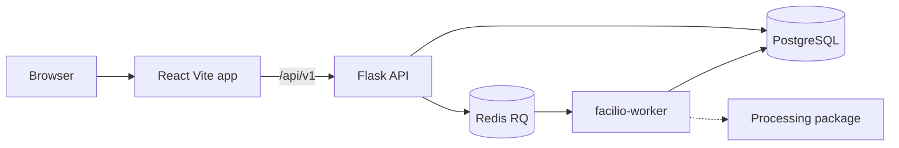

# FACILIO

Intelligent Data Operations Platform

FACILIO is a production-oriented data operations workspace for ingesting datasets, understanding structure and quality, constructing reusable processing workflows, and exporting production-ready structured data.

This repository currently represents **Phase 7: Asynchronous job execution, worker runtime, and live run observability**. Scheduling, DAG branching, AI, and exports are not implemented.

## Overview

Phase 1 established the engineering baseline. Phase 2 added FACILIO's visual identity and application shell. Phase 3 added real dataset ingestion. Phase 4 added deterministic profiling and explainable data-quality scores. Phase 5 added immutable dataset versions and a registered transformation engine. Phase 6 added reusable linear workflows. Phase 7 executes those workflows asynchronously: persist a Job and WorkflowRun, enqueue on Redis/RQ, and run in a worker process that reuses the Phase 6 executor.

- Upload CSV, XLSX, and JSON through the Flask API
- Persist dataset metadata in PostgreSQL and the original file in managed storage
- Inspect preview, columns, and source metadata in a dataset workspace
- Rename and delete dataset resources without mutating source bytes
- Analyze a version to persist quality and issues
- Preview and apply bounded cleaning operations to create derived versions
- Inspect lineage, restore an earlier version as current, and compare with parent
- Author reusable workflows, preview the full pipeline, and queue a run
- Observe jobs, attempts, real step progress, cancel, and retry from the Jobs console

The application remains usable if the API is down. Overview system status is read from the live health and readiness APIs and is never fabricated. Overview counters come from `GET /api/v1/workspace/summary`.

## Current Status

**Phase 7 — asynchronous jobs complete. Awaiting review.**

Available:

- Application architecture and developer workflow
- `GET /api/v1/health` and `GET /api/v1/readiness` (database + optional Redis)
- CSV, XLSX, and JSON ingestion with managed source storage
- Dataset list, detail, bounded preview, rename, and delete
- Explicit **Analyze dataset** profiling (not automatic on upload)
- Column profiles, missingness, duplicates, and bounded top values
- Explainable quality dimensions, including honest **Not assessed**
- Issue inventory with filters, pagination, and **Prepare fix**
- Immutable versions, transformation catalog, preview, apply, lineage
- Reusable workflows, sequential validation, full-pipeline preview
- Asynchronous workflow runs (`202`), Jobs console, cancel, retry, attempts
- Run catalog as domain history; Jobs as the operational control plane
- Global Data Quality summary of **current** profiled versions only
- Frontend Overview with live system status and real workspace counters
- Product design system, themed application shell, and command palette
- Local settings for theme, sidebar, and motion

Not available yet:

- Scheduling or cron triggers
- DAG branching or visual node graphs
- AI-generated recommendations or AI workflow generation
- Processed exports
- Authentication
- Deployment

## Architecture



The processing package is an independent engine boundary. Ingestion and profiling are invoked from services, not from Flask route functions.

## Technology Stack

| Layer | Choices |
| --- | --- |
| Frontend | React, TypeScript, Vite, Tailwind CSS, React Router, TanStack Query, Zustand, Lucide React |
| Backend | Python 3.12, Flask, Flask-CORS, Pydantic v2, SQLAlchemy 2.x, Alembic, psycopg |
| Data engine | `packages/processing` (CSV, XLSX, and JSON readers) |
| Persistence | PostgreSQL (product history), Redis (job dispatch) |
| Quality | Ruff, pytest, ESLint, Prettier, Vitest, TypeScript strict mode |
| Infrastructure | Docker Compose, GitHub Actions |

## Repository Structure

```text
FACILIO/
├── apps/api/                 Flask application factory
├── apps/web/                 React TypeScript frontend
├── packages/processing/      CSV, XLSX, and JSON readers
├── sample-data/              Synthetic ingestion fixtures
├── runtime/                  Local upload storage (gitignored)
├── docs/                     Architecture and development notes
├── infrastructure/           Infrastructure notes
├── .github/workflows/        CI
├── docker-compose.yml
└── Makefile
```

## Local Development

Prerequisites: Python 3.12, Node.js 22+, and optionally Docker.

```bash
make install
```

In three terminals:

```bash
make dev-api
make dev-worker
make dev-web
```

`make dev-worker` requires `REDIS_URL` (see `.env.example`). API tests use an in-memory queue and do not need Redis.

- Frontend: http://127.0.0.1:5173
- API: http://127.0.0.1:5050

The API uses port 5050 locally so it does not collide with macOS AirPlay Receiver on port 5000. Docker maps host 5050 to container 5000.

The Vite dev server proxies `/api` to the Flask process.

Copy `.env.example` to `.env` or `apps/api/.env` before using PostgreSQL.

## Backend Setup

```bash
cd apps/api
python3.12 -m venv .venv
source .venv/bin/activate
pip install -e ".[dev]"
flask --app facilio.app:create_app run --debug --port 5050
```

## Frontend Setup

```bash
cd apps/web
npm install
npm run dev
```

## Docker Setup

```bash
cp .env.example .env
docker compose up --build
```

Services:

- PostgreSQL on port 5432
- Redis on port 6379
- API on http://localhost:5050
- Worker (`python -m facilio.worker`)
- Web on http://localhost:5173

The Docker daemon must be running. Compose reads development defaults from `.env.example` if you copy it to `.env`.

## Environment Variables

| Variable | Purpose |
| --- | --- |
| `APP_ENV` | `development`, `testing`, or `production` |
| `SECRET_KEY` | Flask secret; production rejects weak values |
| `DATABASE_URL` | SQLAlchemy URL (`postgresql+psycopg://...`) |
| `CORS_ORIGINS` | Comma-separated browser origins; production rejects `*` |
| `LOG_LEVEL` | `DEBUG`, `INFO`, `WARNING`, `ERROR`, or `CRITICAL` |
| `MAX_CONTENT_LENGTH` | Maximum HTTP request payload size in bytes (multipart overhead) |
| `MAX_UPLOAD_SIZE_MB` | Authoritative uploaded file size limit (default 16) |
| `PREVIEW_MAX_ROWS` | Maximum rows returned by dataset preview (default 100) |
| `PREVIEW_MAX_COLUMNS` | Maximum columns returned by dataset preview (default 200) |
| `UPLOAD_ROOT` | Managed source storage directory (default `runtime/uploads`) |
| `PROFILE_TOP_VALUES_LIMIT` | Bounded categorical top values (default 10) |
| `PROFILE_EVIDENCE_LIMIT` | Bounded issue evidence samples (default 8) |
| `PROFILE_HISTOGRAM_BINS` | Numeric histogram bins (default 10) |
| `PROFILE_DUPLICATE_GROUPS_LIMIT` | Bounded duplicate groups (default 5) |
| `MAX_WORKFLOW_STEPS` | Maximum enabled steps in a workflow (default 50) |
| `REDIS_URL` | Redis connection for RQ (`redis://localhost:6379/0`) |
| `JOB_QUEUE_NAME` | RQ queue name (default `workflows`) |
| `MAX_JOB_ATTEMPTS` | Maximum attempts per job (default 3) |
| `JOB_STALE_SECONDS` | Heartbeat age after which a running job is recovered (default 90) |
| `WORKER_HEARTBEAT_SECONDS` | Worker registry heartbeat interval (default 30) |
| `VITE_API_BASE_URL` | Optional absolute API origin; empty uses the Vite proxy |
| `VITE_PROXY_TARGET` | Proxy target for `/api` |

Production configuration is validated at startup. Invalid production settings fail clearly.

## Database Migrations

```bash
cd apps/api
source .venv/bin/activate
alembic upgrade head
alembic revision -m "describe the change"
```

Phase 4 adds `dataset_profiles`, `column_profiles`, and `quality_issues`. Phase 5 adds `dataset_versions` and `transformations`. Phase 6 adds `workflows`, `workflow_steps`, `workflow_runs`, `workflow_step_runs`, and `dataset_versions.created_by_workflow_run_id`. Apply `alembic upgrade head` before using PostgreSQL.

## Testing

```bash
make test-api
make test-processing
make test-web
```

Or individually:

```bash
cd apps/api && .venv/bin/pytest
cd packages/processing && .venv/bin/pytest
cd apps/web && npm test
```

## Linting

```bash
make lint
make format
make typecheck
```

Backend: Ruff. Frontend: ESLint, Prettier, and `tsc`.

## API Endpoints

All application APIs live under `/api/v1`.

| Method | Path | Purpose |
| --- | --- | --- |
| `GET` | `/api/v1/health` | Process liveness |
| `GET` | `/api/v1/readiness` | Dependency readiness |
| `GET` | `/api/v1/datasets` | Paginated dataset list |
| `POST` | `/api/v1/datasets` | Upload a file, or complete XLSX sheet selection (`staging_id` + `sheet`) |
| `GET` | `/api/v1/datasets/{id}` | Dataset metadata |
| `PATCH` | `/api/v1/datasets/{id}` | Rename the dataset resource |
| `DELETE` | `/api/v1/datasets/{id}` | Delete metadata and managed source file |
| `GET` | `/api/v1/datasets/{id}/preview` | Bounded JSON-safe row preview of the current version |
| `POST` | `/api/v1/datasets/{id}/profile` | Run (or replace) a profile snapshot (`?version=` optional) |
| `GET` | `/api/v1/datasets/{id}/profile` | Profile (`404 PROFILE_NOT_FOUND` if none) |
| `GET` | `/api/v1/datasets/{id}/quality` | Quality dimensions and overall score |
| `GET` | `/api/v1/datasets/{id}/issues` | Paginated issue inventory |
| `GET` | `/api/v1/quality/summary` | Aggregate quality for **current** versions only |
| `GET` | `/api/v1/transformations` | Registered operation catalog |
| `GET` | `/api/v1/workspace/summary` | Dataset, version, workflow, and run counts |
| `GET` / `POST` | `/api/v1/workflows` | Paginated catalog / create definition |
| `GET` / `PATCH` / `DELETE` | `/api/v1/workflows/{id}` | Detail, patch, hard-delete or archive |
| `POST` | `/api/v1/workflows/{id}/archive` | Soft archive |
| `POST` | `/api/v1/workflows/{id}/restore` | Unarchive |
| `POST` | `/api/v1/workflows/{id}/duplicate` | Copy definition (not runs) |
| `POST` | `/api/v1/workflows/{id}/steps` | Append a step |
| `PATCH` / `DELETE` | `/api/v1/workflows/{id}/steps/{sid}` | Configure or remove a step |
| `POST` | `/api/v1/workflows/{id}/steps/reorder` | Persist explicit order |
| `POST` | `/api/v1/workflows/{id}/validate` | Structural + sequential schema checks |
| `POST` | `/api/v1/workflows/{id}/preview` | Ephemeral multi-step preview |
| `POST` | `/api/v1/workflows/{id}/runs` | Synchronous execution |
| `GET` | `/api/v1/workflow-runs` | Paginated runs (`workflow_id`, `dataset_id`, `status`) |
| `GET` | `/api/v1/workflow-runs/{id}` | Run + step timeline |
| `GET` | `/api/v1/datasets/{id}/versions` | Immutable versions |
| `GET` | `/api/v1/datasets/{id}/versions/{vid}` | Version detail |
| `GET` | `/api/v1/datasets/{id}/versions/{vid}/preview` | Bounded preview of a version |
| `GET` / `POST` | `/api/v1/datasets/{id}/versions/{vid}/profile` | Version profile |
| `GET` | `/api/v1/datasets/{id}/versions/{vid}/lineage` | Ancestor chain |
| `GET` | `/api/v1/datasets/{id}/versions/{vid}/comparison` | Compare with parent |
| `POST` | `/api/v1/datasets/{id}/versions/{vid}/transformations/preview` | Dry-run (no persist) |
| `POST` | `/api/v1/datasets/{id}/versions/{vid}/transformations` | Apply; creates a derived version |
| `PATCH` | `/api/v1/datasets/{id}/current-version` | Restore a version as current |

Successful responses:

```json
{ "success": true, "data": {} }
```

Error responses:

```json
{
  "success": false,
  "error": { "code": "STABLE_CODE", "message": "Human readable explanation", "details": null }
}
```

Every response includes `X-Request-ID`.

## Roadmap

1. **Phase 1** — Engineering foundation
2. **Phase 2** — Signature product design system
3. **Phase 3** — Dataset ingestion
4. **Phase 4** — Profiling and data-quality intelligence
5. **Phase 5** — Immutable transformations
6. **Phase 6** — Visual workflows and synchronous run observability (this repository state)
7. **Phase 7** — Jobs, scheduling, and exports (not started)

## Engineering Principles

- No fabricated product functionality
- No secrets in the repository
- No raw exceptions in API responses
- Keep HTTP, business logic, and persistence separate
- Keep the processing engine independent of Flask
- Prefer architecture that can be explained in an interview
- Preview before apply; version instead of mutate; keep the original forever unchanged

See also [docs/architecture.md](docs/architecture.md), [docs/development.md](docs/development.md), [docs/profiling.md](docs/profiling.md), [docs/transformations.md](docs/transformations.md), and [docs/workflows.md](docs/workflows.md).
